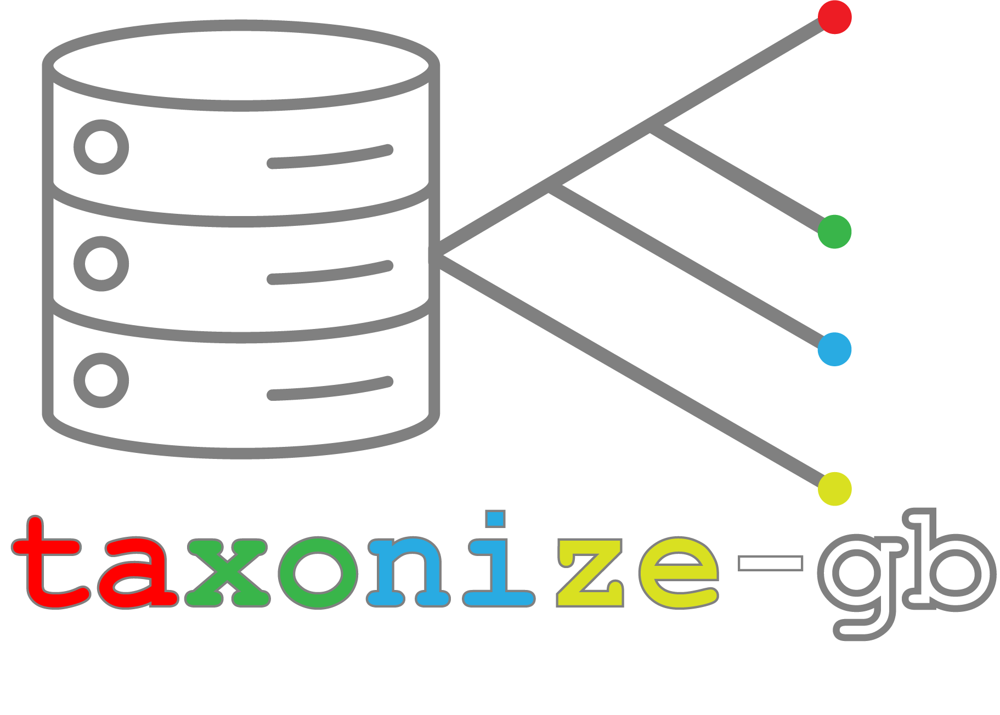

# Taxonize_genbank

[](https://pypi.org/project/taxonize-gb/)

**Taxonize_genbank** is a Python package designed to simplify the process of downloading, filtering, and curating GenBank's non-redundant protein and nucleotide databases based on taxonomy IDs (TaxIDs) and/or specific keywords. This tool is particularly useful for researchers working with large-scale genomic datasets who need to extract specific subsets of data.

The tool supports advanced filtering options, allowing users to:
- **Include Multiple TaxIDs**: Extract sequences associated with multiple taxa by specifying a list of TaxIDs.
- **Exclude Specific TaxIDs**: Remove unwanted or contaminant taxa from the dataset during filtering.

These features make **Taxonize_genbank** highly flexible and customizable for a variety of research applications.

## Features

- Download NCBI databases, including taxonomy, protein, and nucleotide datasets.
- Filter GenBank's non-redundant databases (`nr` or `nt`) by taxonomy ID or keywords.
- Retrieve taxonomic lineages for FASTA accessions.
- Support for advanced filtering using multiple TaxIDs or excluding specific TaxIDs.

---


## Installation

### Prerequisites

Ensure you have the following dependencies installed:

- Python 3.7 or higher
- Biopython: 1.81
- tqdm: 4.64.1
- ete3: 3.1.3
- networkx: 2.6.3
- six: 1.16.0
- isal:1.7.1

### Installation Steps

1. **Clone the Repository**  
   Clone the GitHub repository to your local machine: 

```shell
git clone https://github.com/msabrysarhan/taxonize_genbank
```


2. **Install via pip (Recommended)**  
Alternatively, install `taxonize_gb` directly using pip:

```shell
pip install taxonize-gb
```

---

## Usage

The `Taxonize_genbank` package includes three main modules:

### 1. `get_db.py`: Download NCBI Databases

This module allows you to download NCBI databases required for filtering.

#### Command:

```shell
get_db.py --db_name <DB_NAME> --out <OUTPUT_DIRECTORY>
```

#### Options:
- `--db_name`: Specify the database to download (e.g., `taxdb`, `nr`, `nt`, etc.).
- `--out`: Path to the output directory where the database will be stored.

#### Example:
Download the non-redundant protein database (`nr`):

```shell
get_db.py --db_name nr --out databases/
```

---

### 2. `taxonize_gb.py`: Filter Databases by TaxID or Keywords

This module filters the downloaded database based on taxonomy ID or keywords.

#### Command:

```shell
taxonize_gb.py --db <DB> --db_path <DB_PATH> [OPTIONS] --out <OUTPUT_DIRECTORY>
```


#### Required Arguments:
- `--db`: Specify the database type (`nt` for nucleotide or `nr` for protein).
- `--db_path`: Path to the gzipped FASTA file (if not provided, it will be downloaded automatically).
- `--out`: Path to the output directory.

#### Optional Arguments:
- `--taxid`: Target taxonomy ID to filter for.
- `--keywords`: Keywords to include in FASTA headers.
- Additional arguments for mapping files (`--prot_acc2taxid`, `--nucl_gb_acc2taxid`, etc.).

#### Example:
Filter the non-redundant protein database (`nr`) for plant proteins (TaxID: 33090):

```shell
taxonize_gb.py --db nr --db_path databases/nr.gz
--taxdb databases/taxdump.tar.gz
--prot_acc2taxid databases/prot.accession2taxid.gz
--pdb_acc2taxid databases/pdb.accession2taxid.gz
--taxid 33090
--out plant_nr/
```

---

### 3. `get_taxonomy.py`: Retrieve Taxonomic Lineages

This module extracts taxonomic lineages from GenBank FASTA files.

#### Command:

```shell
get_taxonomy.py --fasta <FASTA_FILE> --map <MAPPING_FILE> --out <OUTPUT_FILE>
```

#### Options:
- `--fasta`: Path to the FASTA file.
- `--map`: Path to the mapping file (e.g., accession-to-taxonomy mapping).
- `--out`: Path to save the output file.

#### Example:
Retrieve taxonomic lineages from a FASTA file:

```shell
get_taxonomy.py --fasta input.fasta
--map databases/prot.accession2taxid.gz
--out taxonomy_lineages.txt
```


---

## Examples

### Example 1: Plant Non-redundant Protein Database
1. Download required files:

```shell
get_db.py --db_name nr --out databases/
get_db.py --db_name prot_acc2taxid --out databases/
get_db.py --db_name pdb_acc2taxid --out databases/
get_db.py --db_name taxdb --out databases/
```

2. Filter for plant proteins (TaxID: 33090):

```shell
taxonize_gb.py --db nr
--db_path databases/nr.gz
--taxdb databases/taxdump.tar.gz
--prot_acc2taxid databases/prot.accession2taxid.gz
--pdb_acc2taxid databases/pdb.accession2taxid.gz
--taxid 33090
--out plant_nr/
```

### Example 2: Insect Non-redundant Nucleotide Database
1. Download required files:

```shell
get_db.py --db_name nt --out databases/
get_db.py --db_name nucl_gb_acc2taxid --out databases/
get_db.py --db_name nucl_wgs_acc2taxid --out databases/
get_db.py --db_name taxdb --out databases/
```

2. Filter for insect nucleotides (TaxID: 50557):

```shell
taxonize_gb.py --db nt
--db_path databases/nt.gz
--taxdb databases/taxdump.tar.gz
--nucl_gb_acc2taxid databases/nucl_gb.accession2taxid.gz
--nucl_wgs_acc2taxid databases/nucl_wgs.accession2taxid.gz
--taxid 50557
--out insect_nt/
```

---

## License

This project is licensed under the **MIT License**.  
See the [LICENSE](LICENSE) file for full details.
